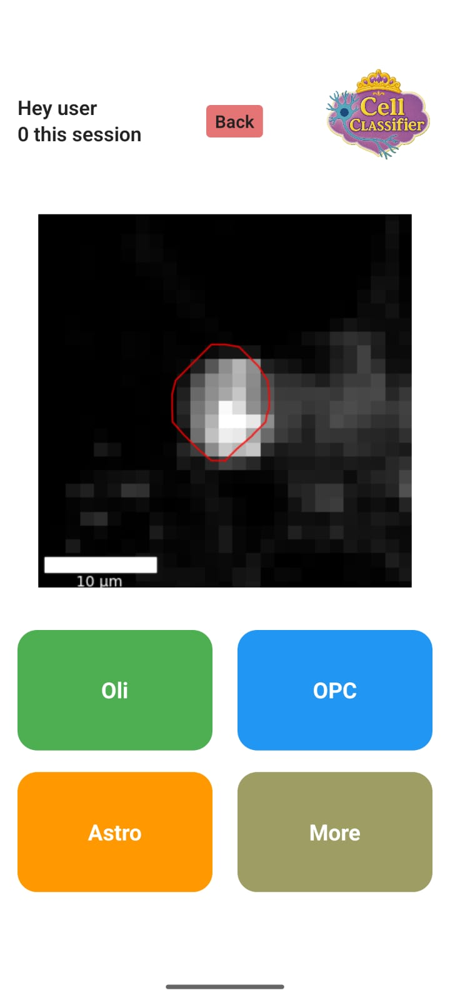

<table style="width:100%; border:none; border-collapse:collapse;">
  <tr>
    <td style="width:60%; vertical-align:top; padding-right:1rem; border:none; font-size:1.1em; line-height:1.4;">
      <h2 style="margin-top:0; font-size:1.4em;">CellClassApp</h2>
      

        CellClassApp is a lightweight, cross-platform web application built with Expo and React Native for streamlined labeling and classification of cellular microscopy images.
      

      

        Backed by Firebase Firestore, it lets small research teams authenticate, tag, and review batches of images in real time, while keeping all data securely in the cloud.
      

      

        Designed with offline support and an intuitive interface, CellClassApp accelerates your data-annotation workflow so you can focus on the science, not the setup.
      

    </td>
    <td style="width:40%; vertical-align:top; border:none;">
      
    </td>
  </tr>
</table>
